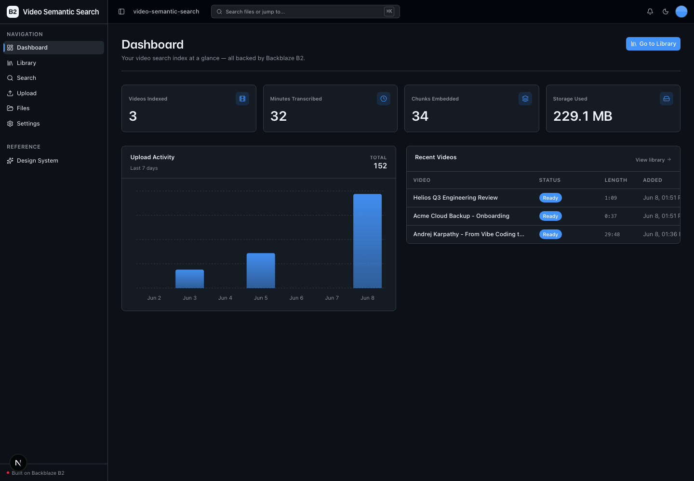
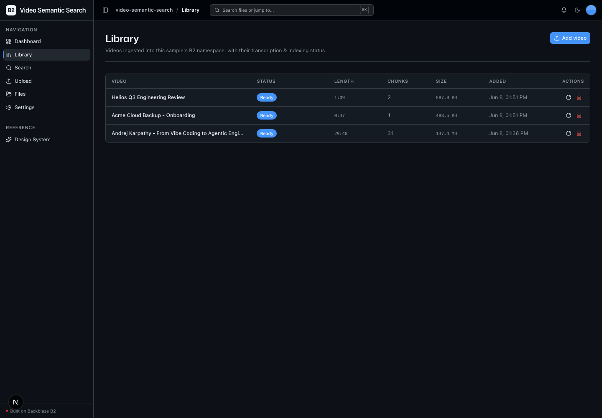
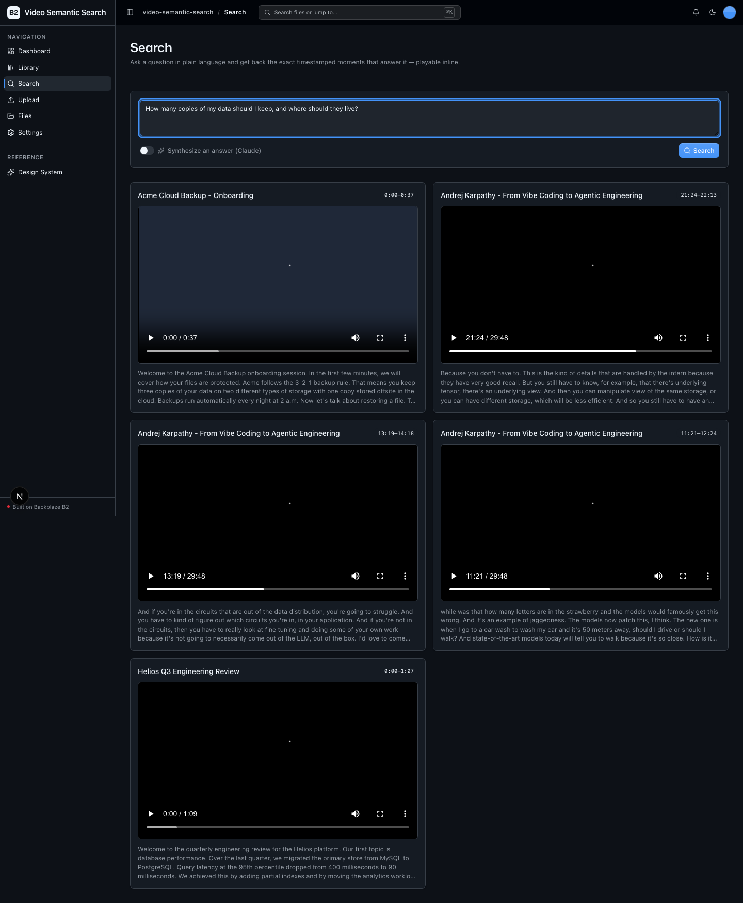

<!-- last_verified: 2026-06-05 -->
# Video Semantic Search

**Chat with your video.** Upload long-form video (lectures, podcasts, webinars, recorded calls, YouTube exports), let Whisper transcribe it, then ask natural-language questions and get back the exact **timestamped moments** that answer them — playable inline.

Every heavy artifact lives in **[Backblaze B2](https://www.backblaze.com/sign-up/ai-cloud-storage?utm_source=github&utm_medium=referral&utm_campaign=ai_artifacts&utm_content=b2ai-video-semantic-search)**: the source video, the extracted audio, the transcript, the embedding index, and any exported clips. B2 is the *sole* data store — there is no separate database, not even for the vectors. This sample exercises B2's write path at scale (presigned **multipart** uploads of multi-GB files, browser → B2 direct) and its read path at scale (repeated presigned-URL reads for playback).

Built on a full-stack TypeScript + Python foundation (Next.js 16 + FastAPI) with a strict layered backend, structural tests, and agent-optimized docs.

## What it looks like

**Dashboard** — index metrics (videos indexed, minutes transcribed, chunks embedded, B2 storage used), a 7-day upload-activity chart, and a recent-videos table.



**Library** — every video ingested into the sample's B2 namespace with its pipeline status, length, chunk count, size, and re-index/delete actions.



**Search** — a natural-language question returns the exact timestamped moments that answer it, each playable inline by seeking the source video in B2.



## How it works

```
Upload (multipart → B2)  →  ffmpeg extracts audio  →  Whisper transcribes
   →  semantic chunking  →  embeddings  →  index stored in B2 (embeddings.json)

Ask a question  →  embed query  →  cosine search over the B2-stored index
   →  ranked timestamped clips  →  play inline by seeking the source video
   (optional: Claude synthesizes an answer over the top clips)
```

## Features

- **[Video ingest](docs/features/video-ingest.md)** — multi-GB presigned multipart upload, browser → B2 direct. The API never buffers the bytes.
- **[Transcription](docs/features/transcription.md)** — Whisper turns audio into timestamped transcript segments stored in B2.
- **[Semantic search](docs/features/semantic-search.md)** — ask in natural language; embeddings + cosine retrieval return the moments that answer it, with an optional Claude-synthesized answer.
- Timestamped clips — results play inline by seeking the source video (presigned URL + media fragments). No clip files generated.
- **[Video Library](docs/features/video-library.md)** — a sample-scoped explorer showing each video's pipeline status and letting you re-index or delete.
- **[File Browser](docs/features/file-browser.md)** — full-bucket browse of every B2 object, kept from the starter kit.
- Graceful degradation — with no AI provider keys, the generic B2 features (upload, files, dashboard) still work; video features surface a clear "configure a provider" state instead of crashing.

## Tech stack

- TypeScript, Next.js 16, React 19, Tailwind v4, shadcn/ui, Recharts, TanStack Query
- Python 3.11+, FastAPI, boto3, Pydantic v2, NumPy
- **Whisper** (OpenAI `audio.transcriptions`) for transcription · OpenAI `text-embedding-3-small` for embeddings · **Claude** (`claude-sonnet-4-6`) for optional answer synthesis
- **Backblaze B2** (S3-compatible object storage) — video, audio, transcripts, the embedding index, and clips
- `ffmpeg` for audio extraction · pnpm workspaces (monorepo)

## Quick start

You need: Node.js ≥ 20, pnpm ≥ 9, Python ≥ 3.11, **ffmpeg**, a free **[Backblaze B2 account](https://www.backblaze.com/sign-up/ai-cloud-storage?utm_source=github&utm_medium=referral&utm_campaign=ai_artifacts&utm_content=b2ai-video-semantic-search)**, and (for the AI pipeline) an OpenAI API key.

**1. Install dependencies**

```bash
pnpm install
brew install ffmpeg            # macOS — or: apt-get install ffmpeg
```

**2. Set up the backend**

```bash
cd services/api
python -m venv .venv && source .venv/bin/activate
pip install -r requirements.txt
cd ../..
```

**3. Configure `.env`**

```bash
cp .env.example .env
```

In the [Backblaze B2 dashboard](https://secure.backblaze.com/b2_buckets.htm?utm_source=github&utm_medium=referral&utm_campaign=ai_artifacts&utm_content=b2ai-video-semantic-search):

1. **Create a bucket** → paste its **Endpoint** into `B2_ENDPOINT` and **Bucket Unique Name** into `B2_BUCKET_NAME`. Set `B2_REGION` to your bucket's region (e.g. `us-west-004`).
2. **Create an application key** with **Read and Write** → paste **keyID** into `B2_APPLICATION_KEY_ID` and **applicationKey** into `B2_APPLICATION_KEY`.
3. For the pipeline, set `OPENAI_API_KEY` (Whisper + embeddings) and optionally `ANTHROPIC_API_KEY` (answer synthesis).

> **Bucket CORS:** large uploads PUT parts to B2 directly from the browser, and playback reads the source by presigned URL. Configure the bucket's CORS to allow `PUT` and `GET` from your web origin (`http://localhost:3000` in dev) and to **expose the `ETag` header** — the browser needs it to complete the multipart upload. See [docs/features/video-ingest.md](docs/features/video-ingest.md).

**4. Run it**

```bash
pnpm dev
```

Frontend at `localhost:3000`, API at `localhost:8000`. `pnpm dev` runs `pnpm doctor` first — a preflight that checks Node/Python/pnpm versions, the venv, `.env`, **ffmpeg**, and ports.

## B2 surface

All operations use the **S3-compatible API** (no b2-native calls). Objects live under a `video-semantic-search/` prefix so the bucket can be shared.

| Path | S3 operations |
|------|---------------|
| Write | `create_multipart_upload`, presigned `upload_part`, `complete_multipart_upload`, `abort_multipart_upload`; `put_object` (artifacts) |
| Read | `list_objects_v2`, `head_object`, presigned `get_object` (playback) |
| Delete | `delete_object`, `delete_objects` (drop a video's whole tree) |
| Health | `head_bucket` |

## Commands

| Command | What it does |
|---------|-------------|
| `pnpm dev` | Start frontend + backend |
| `pnpm dev:web` / `pnpm dev:api` | One side only |
| `pnpm build` | Build + type-check frontend |
| `pnpm lint` / `pnpm lint:api` | Lint frontend / backend |
| `pnpm test:api` | Backend tests (pytest) |
| `pnpm check:structure` | Structural boundary tests |
| `pnpm test:e2e` | Playwright e2e tests |

## Documentation map

| Doc | Purpose |
|-----|---------|
| [AGENTS.md](AGENTS.md) | Agent control surface — start here |
| [ARCHITECTURE.md](ARCHITECTURE.md) | System layout, layering, data flows |
| [docs/features/](docs/features/) | Feature docs (ingest, transcription, search, library, files) |
| [docs/app-workflows.md](docs/app-workflows.md) | User journeys |
| [docs/dev-workflows.md](docs/dev-workflows.md) | Engineering workflows and testing |
| [docs/SECURITY.md](docs/SECURITY.md) · [docs/RELIABILITY.md](docs/RELIABILITY.md) | Security & reliability |

## Status

The scaffold builds, lints, type-checks, and passes structural + unit tests. The end-to-end pipeline (live Whisper/embeddings/Claude calls + clip export) is implemented behind provider adapters but **not yet verified against live providers** — see [docs/exec-plans/tech-debt-tracker.md](docs/exec-plans/tech-debt-tracker.md).

## License

MIT License — see [LICENSE](LICENSE).
